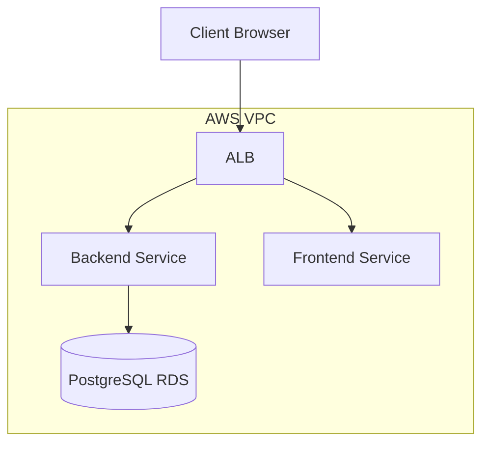

# E-Commerce Application

A full-stack e-commerce application with a Java backend and React frontend, deployed on AWS ECS with an Application Load Balancer.

## Architecture Diagram



## Tech Stack

- **Backend**: Java (Spring Boot)
- **Frontend**: React (Create React App)
- **Infrastructure**: AWS (ECS, ECR, ALB, RDS, VPC)
- **Containerization**: Docker
- **Orchestration**: Terraform
- **CI/CD**: GitHub Actions

## Prerequisites

- AWS Account with appropriate permissions
- Terraform >= 1.0.0
- Docker
- Git
- AWS CLI (for local testing)

## Setup Instructions

### 1. Clone the Repository

```bash
git clone <repository-url>
cd ecommerce
```

### 2. Set Up AWS Credentials

Configure your AWS credentials using one of the following methods:
- AWS CLI: `aws configure`
- Environment variables: `AWS_ACCESS_KEY_ID`, `AWS_SECRET_ACCESS_KEY`, `AWS_DEFAULT_REGION`
- IAM roles (if running on EC2)

### 3. Create S3 Backend for Terraform State

For production use, configure Terraform to use an S3 bucket for state storage. See [Terraform S3 Backend Documentation](https://developer.hashicorp.com/terraform/language/settings/backends/s3).

Example `backend.hcl`:
```hcl
bucket = "your-terraform-state-bucket"
key    = "ecommerce/terraform.tfstate"
region = "us-east-1"
```

Then initialize Terraform with:
```bash
terraform -chdir=infrastructure init -backend-config=backend.hcl
```

### 4. Initialize and Apply Terraform

```bash
cd infrastructure
terraform init
terraform apply -var="db_password=YourSecurePassword123!"
```

### 5. Configure GitHub Secrets

Set up the following secrets in your GitHub repository (Settings > Secrets > Actions):

| Secret Name | Description |
|-------------|-------------|
| `AWS_ACCESS_KEY_ID` | AWS access key ID (if not using OIDC) |
| `AWS_SECRET_ACCESS_KEY` | AWS secret access key (if not using OIDC) |
| `AWS_DEFAULT_REGION` | AWS region (e.g., us-east-1) |
| `AWS_ACCOUNT_ID` | AWS account ID (e.g., 414100287492) |
| `ALB_DNS` | The DNS name of the Application Load Balancer (output from Terraform) |
| `DB_PASSWORD` | Database password for RDS (if using workflow_dispatch for Terraform apply) |

> **Note**: If you prefer to use OIDC for authentication, set up an IAM role that trusts GitHub's OIDC provider and grant it the necessary permissions. Then, in the workflows, use `aws-actions/configure-aws-credentials@v4` with `role-to-assume` instead of access key secrets.

## Deployment Flow

1. Developer pushes code to `main` branch or opens a pull request targeting `main`.
2. GitHub Actions workflow (`ci.yml`) is triggered:
   - `validate`: Checks for required AWS secrets/variables.
   - `build-and-push-backend`: Builds and pushes the backend Docker image to ECR.
   - `build-and-push-frontend`: Builds and pushes the frontend Docker image to ECR.
   - `deploy-backend` (only on main branch push): 
     - Retrieves the current task definition for the backend service.
     - Replaces the image with the newly built image.
     - Registers a new task definition.
     - Updates the service to use the new task definition (triggering a rolling update).
   - `deploy-frontend` (only on main branch push): Same as above for the frontend service.
3. AWS ECS rolls out the new task definitions, and the ALB routes traffic to the updated containers.

## Accessing the Site

After deployment, the application can be accessed at the ALB's DNS name (output as `alb_dns` from Terraform). The frontend is served on port 80, and the backend API is available under the `/api/*` path.

## Destroying Infrastructure

To destroy all Terraform-managed infrastructure:

1. Go to the Actions tab in your GitHub repository.
2. Select the "Terraform" workflow.
3. Click "Run workflow".
4. Set the `action` input to `destroy`.
5. **Important**: You must type `DESTROY` in the `confirmation` input field to confirm the destruction.
6. Click "Run workflow".

## Cost Estimate

This architecture is designed to be cost-effective for development and testing:

- **EC2 t3.micro** (ECS instances): Eligible for AWS Free Tier (750 hours/month)
- **Application Load Balancer**: Eligible for AWS Free Tier (750 hours/month)
- **RDS PostgreSQL db.t3.micro**: Eligible for AWS Free Tier (750 hours/month)
- **ECR Storage**: First 500 MB/month free
- **Data Transfer**: First 1 GB/month free

Beyond the Free Tier, estimated monthly cost is approximately **$20-$50** for light usage. AWS provides $200 in credits for new accounts that can cover several months of usage.

## Troubleshooting

### Common Errors

#### 502 Bad Gateway
- **Cause**: The ALB cannot connect to the target (ECS service).
- **Checks**:
  - Ensure the security group for ECS instances allows inbound traffic from the ALB security group on ports 80 and 8080.
  - Verify that the ECS service is running and healthy.
  - Check the container ports in the task definition match those in the ALB target group.

#### 503 Service Unavailable
- **Cause**: No healthy targets in the target group.
- **Checks**:
  - Verify that the ECS service has at least one running task.
  - Check the health check configuration in the target group (should match the container port).
  - Look at the task logs for application startup errors.

#### Timeout Errors
- **Cause**: Application takes too long to respond or health checks fail.
- **Checks**:
  - Increase the health check timeout interval in the target group if needed.
  - Check application logs for startup delays or errors.
  - Ensure the container has sufficient CPU/memory allocated.

#### No Targets Registered
- **Cause**: ECS service is not registering targets with the ALB.
- **Checks**:
  - Verify that the `target_group_arns` are correctly set in the Auto Scaling Group (see `ecs.tf`).
  - Ensure the ECS container instances are in the same VPC subnets as the ALB.
  - Check the security group rules between the container instances and the ALB.

#### Deployment Fails to Update Service
- **Cause**: IAM permissions or task definition issues.
- **Checks**:
  - Ensure the IAM role used by GitHub Actions has `ecs:DescribeServices`, `ecs:DescribeTaskDefinition`, `ecs:RegisterTaskDefinition`, and `ecs:UpdateService` permissions.
  - Validate the task definition JSON is correctly formatted after image replacement.
